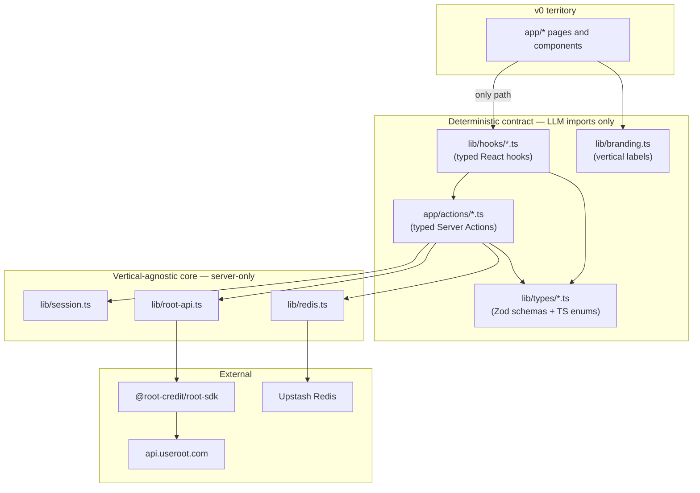

# Generic Root Payouts Template — v0-Ready

> A vertical-agnostic Next.js starter for the **Root Pay sandbox APIs**, designed so v0 (or any LLM) only writes UI while a typed contract layer handles every payments interaction deterministically.

[](https://v0.dev/chat/api/open?title=Root+Payouts+Template&url=https%3A%2F%2Fgithub.com%2Fuseroot%2Froot-sandbox-sdk)
[](https://vercel.com/new/clone?repository-url=https%3A%2F%2Fgithub.com%2Fuseroot%2Froot-sandbox-sdk&env=ROOT_API_KEY,UPSTASH_REDIS_REST_URL,UPSTASH_REDIS_REST_TOKEN,AUTH_SECRET&envDescription=Root+sandbox+key%2C+Upstash+Redis+credentials%2C+and+a+random+session+signing+secret&envLink=https%3A%2F%2Fgithub.com%2Fuseroot%2Froot-sandbox-sdk%2Fblob%2Fmain%2F.env.example)

---

## Why this template exists

Most Root payments demos start the same way: scaffold a Next.js app, copy-paste an SDK call, then spend hours debugging response envelopes, polling, money units, rail selection, and session handling. v0 makes the UI fast, but it has to re-derive the payments contract every time it generates a screen — so each prompt iteration is probabilistic.

This template flips that:

- **The payments contract is locked behind a typed surface.** v0 only ever imports from `lib/hooks`, `app/actions`, `lib/types`, and `lib/branding` — never the SDK directly, never `fetch('/api/...')` from a component.
- **The vertical is just labels.** The data model uses generic terms (`Merchant`, `Payee`, `Payout`). All user-visible copy lives in `lib/branding.ts`. Reskin from "restaurant tipping" to marketplace settlements / payroll / freelance / refunds by editing one file.
- **There's a prompt library.** Six paste-ready prompts (`prompts/01-…` through `prompts/06-…`) generate the most common screens correctly on the first try.
- **There's an `AGENTS.md`.** A single doc Cursor / v0 / Claude / Codex read at session start that encodes the hard rules and contract surface.

---

## 30-second quickstart

```bash
git clone <this repo>
cd root-sandbox-sdk
cp .env.example .env.local      # fill in the four required keys
pnpm install                     # or npm i / yarn
pnpm --filter ./sdk build        # build the bundled SDK once
pnpm dev                         # http://localhost:3000
```

Sign up at `/signup` with any email + the shared password from `.env.local`, link a sandbox bank, add a payee, and run a payout. Then open v0 and paste any prompt from [`prompts/`](prompts) to extend.

> Want to use this as a starter for a brand-new app? Click **"Use this template"** on GitHub, or hit the `Open in v0` button at the top.

---

## Architecture



**The hard rule for v0:** read from `lib/branding.ts`, call hooks/actions, never `fetch`, never import the SDK in client code. See [`AGENTS.md`](AGENTS.md) for the full list.

---

## Working with v0

1. Open this repo in v0 (badge above) or paste the GitHub URL into a v0 chat.
2. Paste any prompt from [`prompts/`](prompts):
   - [`01-payouts-screen`](prompts/01-payouts-screen) — batch payout grid
   - [`02-payee-onboarding`](prompts/02-payee-onboarding) — add-a-payee form (bank or debit card)
   - [`03-merchant-bank-link`](prompts/03-merchant-bank-link) — link the merchant funding bank
   - [`04-transactions-table`](prompts/04-transactions-table) — payout history with status pills
   - [`05-reskin-vertical`](prompts/05-reskin-vertical) — re-skin to a new vertical (one file change)
   - [`06-webhook-listener`](prompts/06-webhook-listener) — `payout.completed` / `payout.failed` listener
3. v0 reads `AGENTS.md`, the contract layer, and `lib/branding.ts` and produces working UI.
4. `.cursor/rules/payments.mdc` and `.cursor/rules/branding.mdc` keep Cursor and Bugbot aligned with the same rules.

---

## Required environment variables

| Variable | Purpose |
| --- | --- |
| `ROOT_API_KEY` | Full sandbox token (`test_<uuid>_<secret>`). A bare UUID will fail. |
| `UPSTASH_REDIS_REST_URL` | Upstash Redis REST URL for sessions, merchants, payees, transactions. |
| `UPSTASH_REDIS_REST_TOKEN` | Upstash Redis REST token. |
| `AUTH_SECRET` | Random ≥32-char string used to HMAC-sign session cookies (`openssl rand -hex 32`). |

See [`.env.example`](.env.example) for the full annotated template (acquisition source for each key, format hint, optional vars).

---

## Repo layout

```
.
├── app/                # Next.js App Router (pages, route handlers, actions)
│   ├── actions/        # Typed Server Actions (the LLM-callable contract)
│   ├── api/            # Thin route handlers that delegate to actions
│   └── dashboard/      # Authenticated console (per-merchant)
├── components/         # UI components — call hooks, never fetch
├── lib/
│   ├── branding.ts     # The ONLY file with vertical copy
│   ├── hooks/          # Typed React hooks for the contract surface
│   ├── types/          # Zod schemas + inferred TS types + enums
│   ├── redis.ts        # Upstash storage primitives (server-only)
│   ├── root-api.ts     # @root-credit/root-sdk wrapper (server-only)
│   └── session.ts      # HMAC-signed cookie session helpers
├── prompts/            # Paste-ready v0 prompts + reference implementations
├── sdk/                # The @root-credit/root-sdk package (vendored)
├── AGENTS.md           # Hard rules, contract surface, recipes
├── LLM-SDK.md          # Mirror of sdk/LLM.md for v0 default context
└── .cursor/rules/      # Auto-applied Cursor rules
```

---

## Determinism guarantees (template + SDK)

| Concern | Where it's enforced |
| --- | --- |
| Money is integer cents | `lib/types/payments.ts` (`Money`, `dollarsToCents`, `formatMoney`) |
| Rails are typed | `PaymentRail` const enum (no string literals) |
| Statuses are typed | `PayoutStatus` const enum |
| No client-side SDK use | `verify-contract` script + `.cursor/rules/payments.mdc` |
| No client-side `fetch('/api/…')` | Same |
| Vertical copy isolated | `lib/branding.ts` is the single source |
| Session cookies signed | HMAC via `AUTH_SECRET` |
| Auth header for SDK | `X-API-KEY` from `ROOT_API_KEY` (full token, not a UUID) |
| Polling | `waitForTerminal` per-rail defaults (see SDK README) |

---

## Verifying you haven't broken the contract

```bash
pnpm verify-contract     # greps for forbidden patterns
pnpm typecheck            # tsc --noEmit
pnpm dev
```

The `verify-contract` script fails if any client-side code imports the SDK directly, calls `lib/root-api`, or uses `fetch('/api/…')`. Add it to your CI to enforce the rules permanently.

---

## SDK

The Next.js app uses `@root-credit/root-sdk`, vendored at [`sdk/`](sdk). Its README is [`sdk/README.md`](sdk/README.md) and its LLM cheat sheet is [`sdk/LLM.md`](sdk/LLM.md) (mirrored at repo root as [`LLM-SDK.md`](LLM-SDK.md) so v0 picks it up by default).

---

## License

MIT
